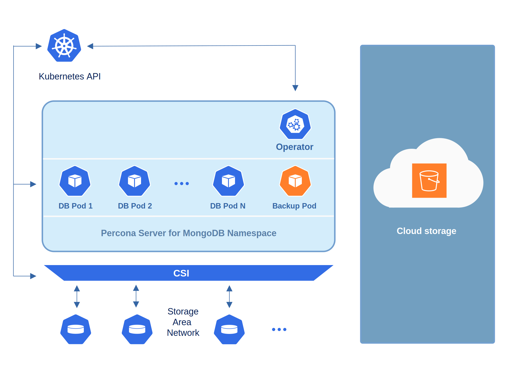

# About backups

The Operator usually stores Server for MongoDB backups outside the Kubernetes
cluster: on [Amazon S3 or S3-compatible storage](https://en.wikipedia.org/wiki/Amazon_S3#S3_API_and_competing_services),
or on [Azure Blob Storage](https://azure.microsoft.com/en-us/services/storage/blobs/).

Backups are done by the Operator using the [Percona Backup for MongoDB](https://github.com/percona/percona-backup-mongodb) tool.

The Operator allows doing cluster backup in two ways. *Scheduled backups* are
configured in the [deploy/cr.yaml](https://github.com/percona/percona-server-mongodb-operator/blob/main/deploy/cr.yaml)
file to be executed automatically in proper time. *On-demand backups* can be
done manually at any moment. 

  The Operator can do either *logical* or *physical* backups.

* *Logical backup* means querying the Percona Server for MongoDB for the database data and writing the retrieved data to the remote backup storage.

* *Physical backup* means copying physical files from the Percona Server for MongoDB `dbPath` data directory to the remote backup storage.

Logical backups use less storage, but are much slower than physical backup/restore.

Also, logical backups are stable, while physical backups are available since the
Operator version 1.14.0 and still have the **technical preview stauts**.

Additionally, physical backups have the following two limitations:

* physical backups can't be used in the cluster with [arbiter nodes](arbiter.md),

* physical backups are currently not compatible with [point-in-time recovery](backups-pitr.md).

!!! warning

    Logical backups made with the Operator versions before 1.9.0 are
    incompatible for restore with the Operator 1.9.0 and later. That is because Percona Backup
    for MongoDB 1.5.0 used by the newer Operator versions
    [processes system collections Users and Roles differently](https://www.percona.com/doc/percona-backup-mongodb/running.html#pbm-running-backup-restoring).
    The recommended approach is to **make a fresh backup after upgrading**
    **the Operator to version 1.9.0**.
